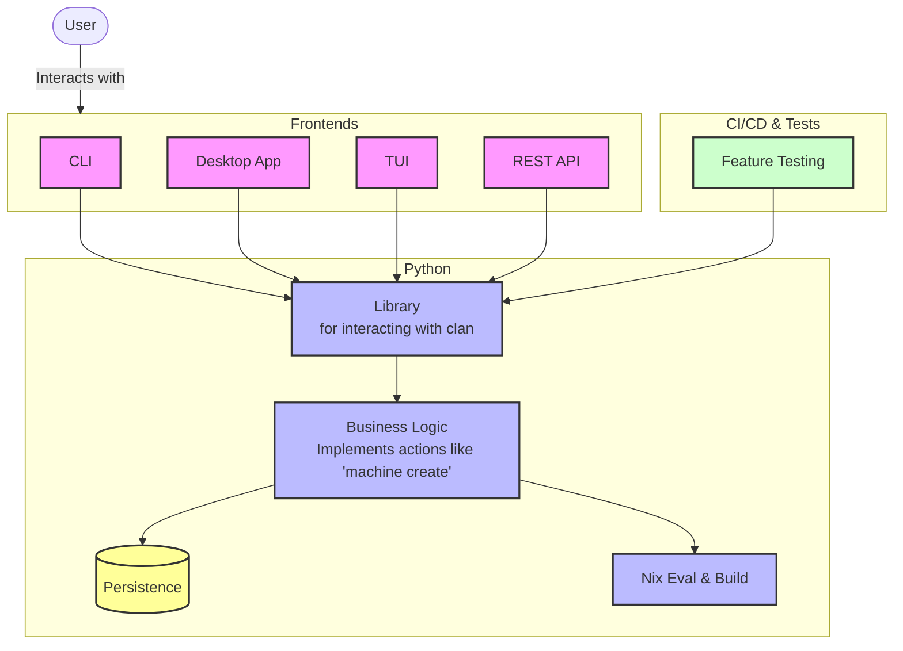

# 02 Clan As Library

## Status

Accepted

## Context

Potential user-facing frontends: `CLI`, `TUI`, `Desktop Application`, `REST-API`, `Mobile Application`. Whether all will exist is uncertain; architecture SHOULD support them without major underlying-system changes.

## Decision

Use `library`-centric development: current `clan` Python code becomes an importable library for multiple tools. Move all **CLI**/**UI** code out of the main library.

Illustrative architecture:

The shared library keeps basic features stable across frontends. Test that stability through Python library calls; use both integration and smaller unit tests. Library functions need not generally be JSON-serializable.

Persistence includes, but is not limited to, creating git commits, writing `inventory.json`, reading/writing vars, and interacting with persisted data generally.

## Benefits / Drawbacks

- (+) Looser frontend/backend-team coupling
- (+) Consistency and inherent behavior
- (+) Performance and scalability
- (+) Frontends for different user groups
- (+) Per-function documentation makes Clan-resource interaction convenient
- (+) Library tests stabilize all layers above
- (-) Complexity overhead
- (-) Library requires design and documentation
- (+) Finite function set enables thorough library documentation
- (-) Error handling may be harder
- (+) Common error reporting
- (-) Different frontends need different features; library must include them all
- (+) Core features must be implemented regardless
- (+) VPN benchmarking already uses the existing library and works relatively well

## Implementation considerations

Future details cannot all be specified now. This document establishes the desired project structure; future commits SHOULD advance it.

- Use separate locations or packages for library and CLI.
- Rename `clan_cli` to `clan`; move CLI frontend into a subfolder or separate package.
- No Python Argparse or other CLI-related code in the `clan` library.
- Keep `__init__.py` very minimal: initialize only business-logic models and resources. Every ancestor `__init__.py` executes during module import, so keep all of them small. For example, `from clan_cli.vars.generators import ...` executes both `clan_cli/__init__.py` and `clan_cli/vars/__init__.py` when present.
- No `api` folder: Python library `clan` is the API.
- Put web-UI JSON serialization/deserialization in a `json-adapter` folder or package.
- Persistence needs serialization for dataclasses and typed dictionaries, including `inventory.json` read/write.
- `inventory.json` is an internal backend resource. Its logic covers merging, unmerging, and partial updates while considering Nix values and priorities. Nobody should read/write it directly; expose library methods such as adding a `service` and updating, reading, or deleting information.
- Design library functions carefully, using suitable good-API conventions: https://swagger.io/resources/articles/best-practices-in-api-design/
