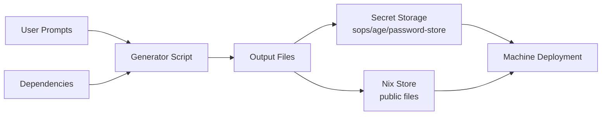
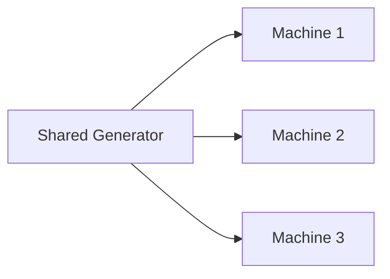

# Vars Concepts

## Clan Vars Architecture
Vars: declarative, reproducible management of generated NixOS files, especially secrets.

### Data Flow



### Design Principles

- **Declarative generation:** vars declared in NixOS configuration; deterministic generation → reproducible deployments, unlike imperative secret management.
- **Separation of concerns:** generator scripts hold generation logic; pluggable backends handle storage; NixOS activation scripts handle deployment; file permissions and ownership enforce access control.
- **Dependency composition:** generators may depend on other generator outputs, forming complex workflows and a directed acyclic graph (DAG):

```text
# Dependencies create a directed acyclic graph (DAG)
A → B → C
    ↓
    D
```

  Certificate authorities can use intermediate certificates dependent on root certificates.
- **Type safety:** secret files expose `.path` only; plaintext is never readable at evaluation time; target deployment uses `/run/secrets/`, or `/run/secrets-for-users/` when `neededFor = "users"`. Public files expose `.path` or `.value` and reside in the nix store. This separation prevents accidental secret exposure.

### Storage Backend Architecture

Pluggable backends handle encryption/decryption:

- `sops` (default): integrates with Clan's existing sops encryption
- `password-store`: for users using pass
- `age`: stores secrets encrypted with age recipients
- `custom`: user-defined secret store

### When Generation Runs

1. Before deployment, `clan vars generate` creates missing vars.
2. During deployment, missing vars are generated by `clan machines update`.
3. `--regenerate` replaces existing values on demand.

### Deployment Timing with `neededFor`

`neededFor` controls when a file's secret becomes available on the target during system activation:

- `partitioning`: before disko runs, e.g. filesystem encryption keys
- `activation`: before `nixos-rebuild` / `nixos-install`
- `users`: before users and groups are created; required for user passwords; stored in `/run/secrets-for-users/`
- `services` (default): available to normal services at runtime

User password hash required before account creation:

```nix
files."user-password-hash" = {
  neededFor = "users";
};
```

### Multi-Machine Coordination

`share = true` on a generator enables cross-machine secret sharing:



Uses: shared certificate authorities, mesh VPN pre-shared keys, cluster join tokens.

### Generator Composition

Compose simple generators for complex, modular, testable systems:

```text
root-ca → intermediate-ca → service-cert
         ↓
     ocsp-responder
```

Each generator focuses on one task.

### Key Advantages

Compared with manual secret management, vars provides:

- **Declarative configuration:** define once, generate consistently
- **Dependency management:** build complex systems with generator dependencies
- **Type safety:** separate secret and public file handling
- **User prompts:** gather input when needed
- **Easy regeneration:** update secrets with one command
